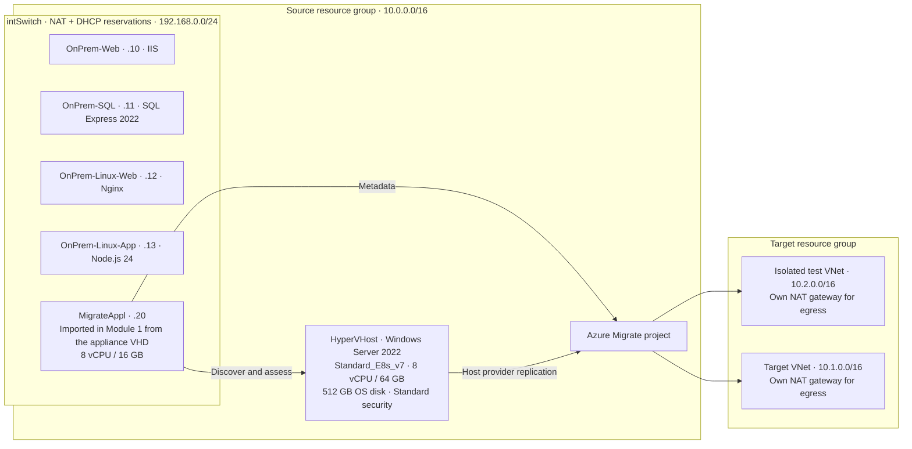

# TD SYNNEX | Azure Migrate Hyper-V Workshop

**Cloud Enablement Services** · Partner hands-on training

Work through the guides linked below in order. Each module builds on the environment the previous one left behind.

Discover, assess, test and migrate four Hyper-V VMs to Azure, then validate and clean up the environment. All four workloads use the **Hyper-V host replication provider**. The discovery appliance performs assessment; the replication provider on the Hyper-V host moves VM data. SQL Server does not require a different replication architecture simply because it stores data. [Microsoft Hyper-V migration tutorial](https://learn.microsoft.com/azure/migrate/tutorial-migrate-hyper-v)

**Release status:** awaiting a full live Azure/Hyper-V run. Validate the scripts end to end in a training subscription before partner delivery, and record the revision you used.

## Learning path

Provision the environment before the teaching session. Budget a full working day for initial delivery; actual deployment, discovery, replication and backup time depends on bandwidth, quota and regional capacity. Measure the duration yourself before advertising a timed agenda.

| Module | Exercise | Completion evidence |
|---|---|---|
| 0 | [Setup](docs/Module-0-Setup.md) | Four nested VMs healthy; host staging space confirmed |
| 1 | [Discovery and assessment](docs/Module-1-Discovery.md) | Four workload names discovered and an Azure VM assessment; optionally a populated dependency map via the [lab traffic mesh](docs/Lab-Traffic.md) |
| 2 | [Hyper-V replication and test migration](docs/Module-2-HyperV-Migration.md) | Successful isolated tests for every workload |
| 3 | [Cutover and stateful validation](docs/Module-3-Stateful-Migration.md) | Planned migration, SQL data comparison, application acceptance |
| 4 | [Azure Migrate and Site Recovery](docs/Module-4-ASR-Comparison.md) | Explain migration versus ongoing disaster recovery |
| 5 | [Post-migration operations](docs/Module-5-Post-Migration.md) | Monitoring evidence, optional backup/restore, cost and security review |
| Finish | Cleanup | Test/replication artifacts and all workshop resources accounted for |

## Environment



This is a **single nested Hyper-V host**, not a cluster or a production landing zone. Its internal NAT topology is a workshop adaptation. Microsoft documents an external switch for a production appliance deployment; validate the nested topology yourself and do not describe it as production support certification. [Appliance prerequisites](https://learn.microsoft.com/azure/migrate/deploy-appliance-script)

The sites and Node API are independent samples. The IIS page is static; Nginx is not a reverse proxy; the Node API has no database client or persistence. The SQL database remains named `ContosoApp` to keep its sample schema and validation stable.

## Start here

1. Read [Module 0](docs/Module-0-Setup.md), including subscription, quota, licensing, downloads and cost preparation.
2. Obtain the repository and record the exact commit shown below. For partner delivery, supply the release tag or commit you validated so every learner uses the same revision. Run these commands in a terminal, then continue from the repository directory:

   ```bash
   git clone --branch main https://github.com/j33pguy/azure-migrate-workshop.git
   cd azure-migrate-workshop
   git rev-parse HEAD
   ```

3. In a PowerShell session with the current Az modules, choose your dedicated subscription and variables:

```powershell
Connect-AzAccount
$subscriptionId = Read-Host 'Workshop subscription ID'
Set-AzContext -SubscriptionId $subscriptionId
$sourceRg = 'rg-ces-source-01'
$targetRg = 'rg-ces-target-01'
$location = 'eastus'
$adminCidr = Read-Host 'Your public IPv4 address followed by /32'
$password = Read-Host 'Lab-only administrator password' -AsSecureString

.\scripts\deploy-lab.ps1 -SubscriptionId $subscriptionId `
    -ResourceGroupName $sourceRg -Location $location `
    -AdminUsername 'labadmin' -AdminPassword $password -AdminSourceCidr $adminCidr

.\scripts\migrate-step1-setup-project.ps1 -SubscriptionId $subscriptionId `
    -SourceResourceGroup $sourceRg -TargetResourceGroup $targetRg -Location $location
```

The deployment scripts require **new, dedicated resource groups**. They intentionally refuse existing groups: replaying setup after cutover could restart the retired source VMs. They do not register the appliance or start replication. Complete Module 1 next.

## Script responsibilities

| Script | Behavior |
|---|---|
| `deploy-lab.ps1` | Billable source host, nested guests, DHCP/NAT and samples; verifies appliance staging space; protected setup parameters; fails if readiness is not observed |
| `host/configure-host.ps1` | Runs inside the Windows host; creates the four workload VMs and stages the optional traffic generator |
| `migrate-step1-setup-project.ps1` | Billable target/test network preparation; portal project creation follows |
| `enable-lab-traffic.ps1` | Optional; staged on HyperVHost by deployment and run there with its generated settings file. Wires the four workloads into one order desk so dependency analysis has real traffic to observe; `-Disable` reverses it |
| `migrate-step2` – `migrate-step5` | Discovery/assessment, replication, test migration and cutover helpers for Modules 1–3 |
| `migrate-step6-post-migration.ps1` | Read-only VM inventory and Module 5 handoff |
| `cleanup-lab.ps1` | Preview/confirmed deletion of explicitly named, tagged groups; refuses vaults and locks |

## Costs and teardown

Estimate the host, OS disk, target/test VMs, replicated disks/storage, **two NAT gateways and their public IPs**, monitoring ingestion, optional Bastion and optional backup/DR. Use the [Azure pricing calculator](https://azure.microsoft.com/pricing/calculator/) for your region and agreement. There is no verified fixed daily price for this workshop. Deallocating VMs stops VM compute charges but does not remove billable disks, NAT gateways, IPs or retained backups.

```powershell
.\scripts\cleanup-lab.ps1 -SubscriptionId $subscriptionId `
    -ResourceGroupName $targetRg,$sourceRg -WhatIf
```

Review the preview output before running the deletion without `-WhatIf`.

## A note from the author

These notes record environment issues met while building and running this lab, and why parts of the scripts look the way they do. They are observations from one subscription and one region, not a compatibility matrix.

**The host size default changed from `Standard_E8s_v5` to `Standard_E8s_v7`.** The v5 size was not available to the subscription this lab was built in. Esv7 offers the same 8 vCPU / 64 GB shape and reports nested virtualization support, so it became the default. `deploy-lab.ps1` validates whatever size you pass against your own subscription's SKU metadata and quota, so a different family works if it meets the lab's floor.

**Esv7 is a Generation 2 only series, and its sizes require an OS image with NVMe support.** The workshop's Windows Server 2022 Gen2 host image satisfies both. If you change the host image, check those two properties first.

**Deployment pins the image catalog API version and forces Standard security on the temporary guest disk.** Both are deliberate. Letting the installed Az.Compute module pick its own API version produced inconsistent results across machines, and the disk cmdlets will otherwise default a Trusted Launch image lookup that is incompatible with exporting the disk to nested Hyper-V guests.

**The Azure Migrate appliance VHD Microsoft publishes for Hyper-V is Generation 1.** Module 1 creates the appliance VM with `-Generation 1` for that reason. Confirm the current generation and disk format in Microsoft's article before you run it — a Generation 2 VM will not boot a Generation 1 VHD, and the failure looks like a corrupt download.

**The lab stages the appliance on the host's own OS disk.** An earlier revision attached a separate managed data disk for this. It was removed because the 512 GB OS disk already has the capacity and a data disk bills continuously, including while the VM is deallocated.

No attempt has been made to solve for environments beyond the one this was built in. If you hit a different compatibility problem — a region without the host size, a policy that blocks disk export, a proxy that blocks a package source — please open an issue with the error and your region and subscription type. Feedback of that kind is what turns one environment's findings into guidance that holds up more broadly.

## Maintenance and provenance

Parse every script with PowerShell before sharing changes, and confirm the documentation links resolve. The host-side scripts target Windows PowerShell 5.1; the deployment client works on either 5.1 or PowerShell 7.

The supplied source has an [MIT license](LICENSE) attributed to Pamir Erdem. Its GitHub metadata reports a standalone repository; the claimed Microsoft original was not identified. Preserve the existing license and trace the original source before making Microsoft-derived attribution claims.
